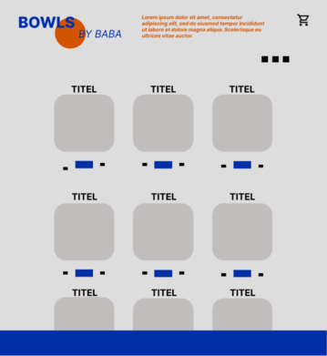
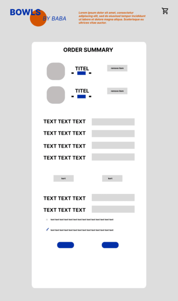
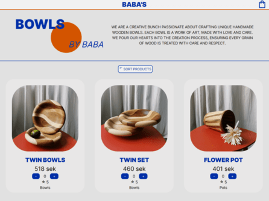
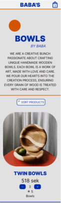
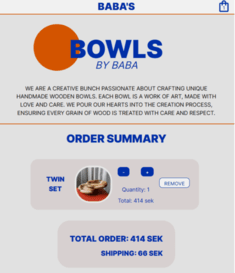
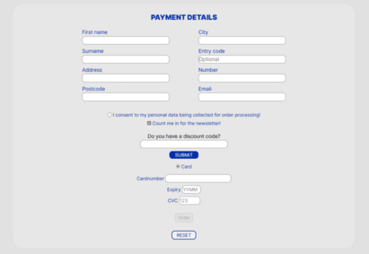
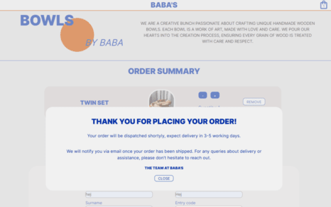
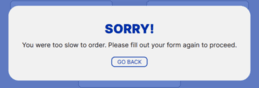

# Bowls by Baba
Bowls by Baba is hopefully just the beginning of further showcasing the hidden treasures of my father's woodworking mastery. This assignment was a great opportunity for me to both aqcuire new skills as well as pay homage to my father's work. Each piece presented here is a testament to his unparalleled skill, encapsulating a legacy of artistry, precision, and dedication. It's not merely a display of products; it's a celebration of his artistry that has fueled my own love for creativity. 

## Demolink
https://medieinstitutet.github.io/fed23d-js-grundkurs-webshop-alahojat/

## Authors
- [@alahojat](https://www.github.com/alahojat)

## Built with

   

## Outtake from initial wireframes

## Excerpt from final result

## Assignment requirements
Code logic, 
 Selfdocumented code with clear comments,
Hög kodkvalitet, konventioner
Conditionals (if-satser)
Events
DOM manipulation
Functions 
Variables
Arithmetic
Objects
Arrays
Timers
Loops
Date

## Lessons Learned

As a first time experience with Javascript, let alone a programming language, the lessons have been endless. Extremely challenging whilst simultaneously very rewarding. It has kept my mind and creativity occupied and now in hindsight, despite all the challenges, I have thoroughly enjoyed seeing the project come together.

My general takeaways ahead of future projects are as follow:
- always spend more time than initially planned on the initial research, planning and design part of any project
- ensure I have finished workflows ready before embarking on any type of code

Javascript specific lessons:
- ensure function/variable naming is more deliberate and adheres to a system/structure
- spend time on writing clear comments immediately after each code/section

Processes learnt and used in project
- variables, for-loops, for-each-loops, functions, eventlisteners  

## Optimizations
Re accessibility: I had to reevaluate the use of the colourpalette to truly optimize full accessibility as there was a slight discrepancy in the contrast of the orange font-colour against the chosen grey background. If I had more time I would thoroughly research a better combination of colours.

## Validation reports

## 🚀 About Me
blue is the warmest colour. a sucker for visual communication. currently studying frontend development at @Medieinstitutet

